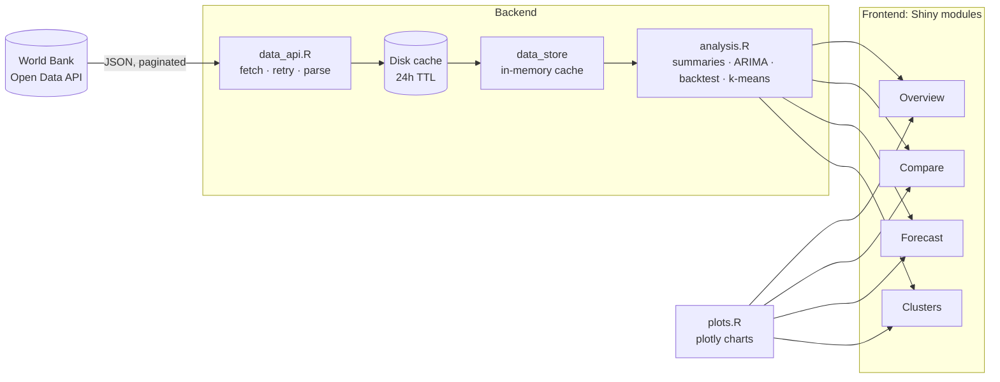

# 🌍 World Development Explorer

[](https://github.com/YOUR_GITHUB_USERNAME/world-dev-explorer/actions/workflows/ci.yml)


**An interactive R/Shiny dashboard to explore, compare, forecast and cluster
development indicators for 214 countries, powered by live data from the
[World Bank Open Data API](https://data.worldbank.org).**

---

## 📑 Table of contents

- [Why this project](#-why-this-project)
- [Features](#-features)
- [How to use the app](#-how-to-use-the-app)
- [Indicators](#-indicators)
- [Methodology](#-methodology)
- [Architecture](#%EF%B8%8F-architecture)
- [Project structure](#-project-structure)
- [Getting started](#-getting-started)
- [Testing](#-testing)
- [Docker](#-docker)
- [Deployment](#%EF%B8%8F-deployment)
- [Continuous integration](#-continuous-integration)
- [Troubleshooting](#%EF%B8%8F-troubleshooting)
- [Limitations](#%EF%B8%8F-limitations)
- [Roadmap](#%EF%B8%8F-roadmap)
- [Tech stack](#-tech-stack)
- [Data source and licence](#-data-source-and-licence)
- [License](#-license)

---

## 💡 Why this project

Public development data is rich but hard to explore: it's spread across
thousands of series, and raw tables don't show trends, comparisons or what
might come next. This app turns the World Bank's World Development Indicators
into an interactive tool that answers questions like:

- *Which countries have the highest life expectancy, and how has that changed since 2000?*
- *How fast has China's GDP per capita grown compared with India's or Brazil's?*
- *Where is India's population heading over the next 10 years, and how confident is that forecast?*
- *Which countries have similar development profiles?*

It is also built as a small but complete piece of software: separate data,
analysis and UI layers, automated tests, containerisation and CI.

---

## ✨ Features

### 🗺️ Overview
- World **choropleth map** for any of 9 indicators, with a year slider from 2000 to the latest available year
- Log-scaled colours for skewed indicators (GDP, population, CO2) so differences between poorer countries stay visible
- **Headline stats**: number of countries with data, global median, highest and lowest country
- **Top-10 table** for the selected indicator and year
- Countries missing a value for the selected year fall back to their most recent value from the previous 5 years (the year is shown)

### 📈 Compare
- Trend lines for **up to 8 countries** at once, with a unified hover tooltip
- Adjustable year range and **log-scale** toggle
- **Growth summary**: first vs latest value, absolute change and **compound annual growth rate (CAGR)**
- **Export to CSV**

### 🔮 Forecast
- **Automatic ARIMA model selection** (`forecast::auto.arima`) for any country and indicator
- 1–10 year horizon with **80% and 95% prediction intervals**
- Forecasts are clipped to natural bounds (e.g. percentages stay between 0 and 100)
- **5-year backtest** against a naive "no change" baseline, colour-coded green when the model beats the baseline and orange when it doesn't

### 🧩 Clusters
- **k-means clustering** (k = 2 to 7) on GDP per capita (log), life expectancy, internet use and electricity access
- Features are standardised; clusters are relabelled from lowest to highest average GDP so colours stay stable
- **Scatter plot**, **cluster map** and **cluster profile table**
- **Elbow chart** showing variance explained for each k, to help choose the number of clusters

### ⚙️ Under the hood
- Resilient API client: pagination, **retries with backoff**, **24-hour disk cache** and **stale-cache fallback** when the API is unreachable
- In-memory cache shared across user sessions
- Friendly in-app messages instead of crashes when data is missing or too short to model
- **27 tests / 75 expectations**, including Shiny server tests, all runnable offline

---

## 🧭 How to use the app

Each tab has its controls in the **left sidebar** (click the arrow at the top
left if it is collapsed). Every chart supports **hover** for exact values, and
has a toolbar (top right on hover) to **zoom**, **reset** or **download a PNG**.
Cards can be expanded to **full screen** with the ⤢ button.

| Tab | Try this |
|---|---|
| **Overview** | Choose *Internet users* and drag the year from 2000 to 2024 to watch internet adoption spread across the world. |
| **Compare** | Add Pakistan, India and Bangladesh, choose *Life expectancy*, then check the CAGR column. Click a country in the legend to hide it. |
| **Forecast** | Pick *India + Population* (backtest error below 1%), then *India + Inflation*, and compare how much wider the uncertainty bands get. |
| **Clusters** | Move k from 3 to 5 and watch the groups split. Use the elbow chart to judge which k fits best. |
| **About** | Summary of the app's features and architecture. |

---

## 📊 Indicators

| Indicator | World Bank code | Unit | Map scale |
|---|---|---|---|
| GDP per capita (current US$) | `NY.GDP.PCAP.CD` | US$ | log |
| Life expectancy at birth | `SP.DYN.LE00.IN` | years | linear |
| Population | `SP.POP.TOTL` | people | log |
| Internet users | `IT.NET.USER.ZS` | % of population | linear |
| Access to electricity | `EG.ELC.ACCS.ZS` | % of population | linear |
| CO2 emissions per capita | `EN.GHG.CO2.PC.CE.AR5` | tonnes | log |
| Unemployment | `SL.UEM.TOTL.ZS` | % of labour force | linear |
| Inflation, consumer prices | `FP.CPI.TOTL.ZG` | annual % | linear |
| Education spending | `SE.XPD.TOTL.GD.ZS` | % of GDP | linear |

To add another indicator, add one row to the `INDICATORS` table in
[`R/indicators.R`](R/indicators.R). Every tab picks it up automatically.

---

## 🔬 Methodology

### Forecasting
1. The country's annual series is built from 2000 onwards; **interior gaps are
   filled by linear interpolation**.
2. At least **10 years** of data are required; otherwise the app explains why
   it can't forecast.
3. `forecast::auto.arima()` selects the ARIMA order (p, d, q) and whether to
   include drift, by minimising AICc.
4. The forecast and its 80% / 95% intervals are clipped to the indicator's
   natural bounds.

### Backtesting
To show whether a forecast is worth trusting, the app:
1. Hides the **last 5 years** of data.
2. Fits ARIMA on the remaining years and forecasts the hidden 5.
3. Compares it with a **naive baseline** (the last known value repeated).
4. Reports the **Mean Absolute Percentage Error (MAPE)** of both.

Example results (World Bank data as of September 2026):

| Country | Indicator | Selected model | ARIMA MAPE | Naive MAPE |
|---|---|---|---|---|
| India | GDP per capita | ARIMA(0,1,0) with drift | **13.0%** | 21.7% |
| India | Population | ARIMA(0,2,1) | **0.2%** | 2.5% |
| Pakistan | Population | ARIMA(1,1,2) with drift | **0.5%** | 5.0% |
| USA | CO2 per capita | ARIMA(0,1,1) with drift | **2.7%** | 8.2% |
| India | Internet users | ARIMA(0,2,0) | 41.1% | **26.7%** |

Smooth, trending series (population, GDP) forecast well. Series with shocks
or saturation (inflation, internet adoption) are much harder, and the backtest
shows that honestly instead of hiding it.

### Clustering
1. For the selected year, each country's latest value within the previous
   5 years is used for each of 4 features; countries missing any feature are
   excluded.
2. GDP per capita is **log-transformed**, then all features are
   **standardised** (z-scores) so no single unit dominates.
3. `stats::kmeans()` runs with **25 random starts** and a fixed seed, so
   results are reproducible.
4. Clusters are renumbered by average GDP (1 = lowest).
5. The elbow chart plots between-cluster variance ÷ total variance for k = 2 to 8.

With k = 4 on 2023 data, the clusters explain **84% of the variance** across 187 countries.

---

## 🏗️ Architecture



**Design principles**

- **Layered code.** `data_api.R` and `analysis.R` are plain R functions with no
  Shiny dependency, so they can be unit-tested directly and reused outside the app.
- **One module per tab.** Each `mod_*.R` file holds a matching `*_ui()` and
  `*_server()` pair, which keeps the UI code small and testable with
  `shiny::testServer()`.
- **Dependency injection.** Modules receive a `load_indicator` function rather
  than calling the API themselves, so tests swap in a fake loader and run offline.
- **Fail soft.** API errors are retried, then served from a stale cache, then
  shown as a readable message, never a crash.

---

## 📁 Project structure

```
world-dev-explorer/
├── app.R                     # Entry point: page layout, theme, module wiring
├── R/                        # Shiny auto-loads everything in this folder
│   ├── data_api.R            # World Bank API client, pagination, retries, caching
│   ├── analysis.R            # Summaries, CAGR, ARIMA forecast, backtest, k-means
│   ├── indicators.R          # Indicator catalogue (labels, units, scales, bounds)
│   ├── format.R              # Number formatting ($1,234 · 12.3% · 1.4B)
│   ├── plots.R               # plotly chart builders (maps, lines, forecast, clusters)
│   ├── mod_overview.R        # Overview tab
│   ├── mod_compare.R         # Compare tab
│   ├── mod_forecast.R        # Forecast tab
│   ├── mod_clusters.R        # Clusters tab
│   └── mod_about.R           # About tab
├── www/
│   └── styles.css            # Custom styling
├── tests/
│   └── testthat/
│       ├── setup.R           # Loads R/ and shared test helpers
│       ├── test-data_api.R   # Parsing, retries, pagination, caching
│       ├── test-analysis.R   # Summaries, forecasting, backtest, clustering, formatting
│       ├── test-modules.R    # Shiny server tests for every tab
│       └── fixtures/         # Saved API responses for offline tests
├── .github/workflows/ci.yml  # GitHub Actions: tests + Docker build
├── .vscode/                  # Recommended VS Code extension and settings
├── Dockerfile
├── install.R                 # Installs all required packages
├── run_tests.R               # Runs the test suite
└── LICENSE
```

---

## 🚀 Getting started

### Prerequisites

| Tool | Version | Required? |
|---|---|---|
| [R](https://cran.r-project.org) | 4.4 or newer | ✅ Yes |
| [VS Code](https://code.visualstudio.com) + [R extension](https://marketplace.visualstudio.com/items?itemName=REditorSupport.r) | latest | Recommended (RStudio also works) |
| [Git](https://git-scm.com) | any | To clone the repo |
| [Docker](https://www.docker.com) | any | Optional |

No API key is needed. The World Bank API is free and public.

### 1. Clone the repository

```bash
git clone https://github.com/YOUR_GITHUB_USERNAME/world-dev-explorer.git
cd world-dev-explorer
```

### 2. Install the R packages

```bash
Rscript install.R
```

This installs `shiny`, `bslib`, `plotly`, `DT`, `jsonlite`, `dplyr`, `forecast`,
`testthat` and `languageserver` (for VS Code), skipping any you already have.

### 3. Run the app

```bash
Rscript -e "shiny::runApp('.', launch.browser = TRUE)"
```

The app opens in your browser. The first time you open each indicator it
takes a few seconds to download from the World Bank; after that it loads
instantly from the local `cache/` folder. Press **Ctrl + C** in the terminal
to stop the app.

> **Windows:** if `Rscript` is not recognised, use the full path, e.g.
> `& "C:\Program Files\R\R-4.4.1\bin\Rscript.exe" install.R`, or add
> `C:\Program Files\R\R-4.4.1\bin` to your PATH. See [Troubleshooting](#%EF%B8%8F-troubleshooting).

### Configuration

| Environment variable | Default | Purpose |
|---|---|---|
| `WDE_CACHE_DIR` | `./cache` | Where downloaded data is cached. Delete this folder to force a fresh download. |

---

## 🧪 Testing

```bash
Rscript run_tests.R
```

Expected output:

```
✔ |         40 | analysis
✔ |         24 | data_api
✔ |         11 | modules

[ FAIL 0 | WARN 0 | SKIP 0 | PASS 75 ]
```

| Test file | What it covers |
|---|---|
| `test-data_api.R` | URL building, JSON parsing, removing regional aggregates, API error payloads, retry logic, pagination, cache hits, cache expiry, stale-cache fallback, in-memory memoisation |
| `test-analysis.R` | Latest values, CAGR, trend summaries, gap interpolation, forecast intervals and bounds, short-series errors, backtest vs baseline, feature matrix, clustering order and quality, elbow curve, number formatting |
| `test-modules.R` | Server logic of all four tabs via `shiny::testServer()` with a fake data loader |

All tests run **offline**, using saved API responses in
`tests/testthat/fixtures/` and synthetic data.

---

## 🐳 Docker

```bash
docker build -t world-dev-explorer .
docker run -p 3838:3838 world-dev-explorer
```

Open **http://localhost:3838**.

The image is based on [`rocker/shiny:4.4.1`](https://rocker-project.org) and
only copies what the app needs (`app.R`, `R/`, `www/`).

---

## ☁️ Deployment

### shinyapps.io (free tier)

1. Create an account at [shinyapps.io](https://www.shinyapps.io).
2. Copy your token from **Account → Tokens → Show**.
3. In R, from the project folder:

```r
install.packages("rsconnect")
rsconnect::setAccountInfo(name = "<account>", token = "<token>", secret = "<secret>")
rsconnect::deployApp(appFiles = c("app.R", "R", "www"), appName = "world-dev-explorer")
```

### Anywhere that runs containers
The Docker image runs on any container host (Google Cloud Run, Azure
Container Apps, AWS App Runner, Fly.io, Render and so on). Expose port **3838**.

---

## 🔄 Continuous integration

[`.github/workflows/ci.yml`](.github/workflows/ci.yml) runs on every push to
`main` and on every pull request:

1. **test**: sets up R 4.4 on Ubuntu, installs the packages and runs the full test suite.
2. **docker**: builds the Docker image, but only if the tests pass.

The badge at the top of this README shows the latest result.

---

## 🛠️ Troubleshooting

| Problem | Fix |
|---|---|
| `Rscript is not recognized` (Windows) | Use the full path `& "C:\Program Files\R\R-4.4.1\bin\Rscript.exe" ...`, or add R to your PATH: `[Environment]::SetEnvironmentVariable("Path", [Environment]::GetEnvironmentVariable("Path","User") + ";C:\Program Files\R\R-4.4.1\bin", "User")`, then restart the terminal. |
| `there is no package called 'xyz'` | Run `Rscript install.R`. |
| "Could not load data from the World Bank API" | Check your internet connection. Once data has been cached, the app keeps working offline from the cache. |
| Data looks out of date | Delete the `cache/` folder and restart the app. |
| "Need at least 10 years of data to forecast" | That country/indicator pair has too little history. Pick another. |
| A package "was built under R version x.y.z" warning | Harmless. The package still works. Updating R removes the warning. |

---

## ⚠️ Limitations

- Forecasts are **statistical extrapolations of past trends**; they do not
  account for policy changes, crises or other shocks.
- World Bank data is published with a **lag of 1–2 years**, and coverage
  varies by country and indicator.
- Clustering uses 4 indicators only, and k-means assumes roughly spherical
  clusters of similar size.
- Interpolating gaps can smooth over real volatility in countries with sparse data.

---

## 🗺️ Roadmap

- [ ] Country profile page with every indicator for one country
- [ ] More forecasting models (ETS, Prophet) and automatic model comparison
- [ ] Correlation explorer between any two indicators
- [ ] Shareable URLs that keep the selected tab and filters
- [ ] End-to-end UI tests with `shinytest2`
- [ ] Download charts as a PDF report

---

## 🧰 Tech stack

| Area | Tools |
|---|---|
| Language | R 4.4 |
| Web framework | Shiny, bslib (Bootstrap 5, Flatly theme) |
| Charts and tables | plotly, DT |
| Data | World Bank API, jsonlite, dplyr |
| Modelling | forecast (ARIMA), stats (k-means) |
| Testing | testthat, shiny::testServer |
| DevOps | Docker (rocker/shiny), GitHub Actions |

---

## 📚 Data source and licence

Data comes from the World Bank's
[World Development Indicators](https://datatopics.worldbank.org/world-development-indicators/)
through its [public API](https://datahelpdesk.worldbank.org/knowledgebase/articles/889392).
It is used under the [Creative Commons Attribution 4.0 (CC BY 4.0)](https://datacatalog.worldbank.org/public-licenses)
licence. Regional and income-group aggregates are excluded so only individual
countries are shown.

---

## 📄 License

This project is released under the [MIT License](LICENSE).
